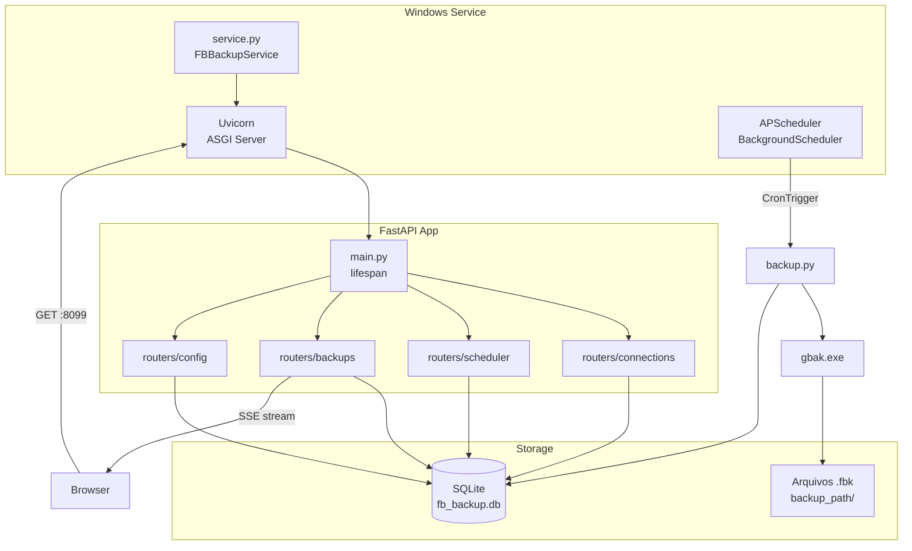

# Arquitetura

![[index|← Voltar ao índice]]

---

## Visão Geral



---

## Estrutura de Arquivos

```
fb-backup-manager/
├── backend/
│   ├── main.py           ← FastAPI app + lifespan
│   ├── models.py         ← SQLModel (tabelas SQLite)
│   ├── database.py       ← engine, sessões, Fernet key
│   ├── backup.py         ← lógica gbak, SSE stream, retenção
│   ├── scheduler.py      ← APScheduler wrapper
│   ├── service.py        ← Windows Service (pywin32)
│   └── routers/
│       ├── connections.py
│       ├── backups.py
│       ├── scheduler.py
│       └── config.py
├── frontend/
│   └── index.html        ← SPA single-file
├── data/                 ← criado em runtime
│   └── fb_backup.db
├── build.sh
├── fb_backup.spec
├── installer.iss
└── requirements.txt
```

---

## Módulos do Backend

### `main.py` — Ponto de entrada

- Define o `lifespan` do FastAPI: cria tabelas → inicia config → carrega agendamentos → inicia scheduler
- Registra todos os routers com prefixo `/api`
- Serve o `frontend/index.html` via `StaticFiles` (catch-all)
- Configura log rotativo (`RotatingFileHandler`, 10 MB, 3 cópias)
- Detecta se está rodando como bundle PyInstaller (`sys.frozen`) para localizar o frontend

### `models.py` — Schema SQLite

Ver [[modelos|Modelos de Dados]] para detalhes completos.

### `database.py` — Camada de dados

```python
# DATA_DIR resolve corretamente em dev e no bundle PyInstaller
if getattr(sys, "frozen", False):
    DATA_DIR = Path(sys.executable).parent / "data"
else:
    DATA_DIR = Path(__file__).parent.parent / "data"
```

> [!important] Por que `sys.executable`?
> Quando o Windows Service inicia o processo, o working directory padrão é `C:\Windows\System32`. Usando `sys.executable` garantimos que o banco sempre fica ao lado do `.exe`, independente de onde o processo foi iniciado.

- `get_fernet_key()` — deriva chave de 32 bytes do `app_secret_key` via SHA-256, codifica em base64 URL-safe (formato Fernet)
- `init_app_config()` — cria registro `AppConfig id=1` na primeira execução, gerando `app_secret_key` com `secrets.token_hex(32)`

### `backup.py` — Motor de backup

Duas funções principais:

| Função | Uso | Modo |
|---|---|---|
| `run_backup(conn, session)` | APScheduler | Síncrono, bloqueia a thread |
| `run_backup_stream(conn, session)` | API manual | Async generator, SSE |

**Comando gbak montado:**
```
gbak.exe -b -v -g -user SYSDBA -password *** host/port:db_path destino.fbk
```

- `-b` backup, `-v` verbose, `-g` inibir garbage collect
- Connection string montada por `build_connection_string()`: `{host}/{port}:{db_path}`
- Nome do arquivo: `{name_slug}_{YYYYMMDD_HHMM}.fbk`
- Retenção: `glob(slug_*.fbk)` ordenado por `mtime`, apaga os excedentes

> [!warning] gbak.exe obrigatório
> O campo `gbak_path` é obrigatório. Sem ele, `run_backup` lança `RuntimeError` imediatamente.

### `scheduler.py` — APScheduler

```python
scheduler = BackgroundScheduler(timezone="UTC")
```

- `load_schedules(session)` — chamado no lifespan; registra um job por `Schedule` ativo
- `add_or_update_job(schedule)` — usa `replace_existing=True`; chamado ao criar/editar agendamento via API
- `remove_job(schedule_id)` — chamado ao deletar agendamento via API
- Job ID: `backup_{schedule_id}`
- `_job_func(schedule_id)` — itera sobre todas as `ScheduleConnection` do agendamento e chama `run_backup` para cada conexão ativa

### `service.py` — Windows Service

```python
class FBBackupService(win32serviceutil.ServiceFramework):
    _svc_name_ = "FBBackupManager"
```

**`SvcDoRun` faz em ordem:**
1. `os.chdir(exe_dir)` — muda o working directory para a pasta do `.exe`
2. `create_db_and_tables()` + `init_app_config()` — garante que o banco existe antes de ler a porta
3. Lê `app_port` do banco
4. Inicia Uvicorn em thread daemon
5. Bloqueia em `win32event.WaitForSingleObject` até receber sinal de parada

> [!bug] Fix do diretório de trabalho
> Sem o `os.chdir`, o Windows Service inicia em `C:\Windows\System32`. O `DATA_DIR` calculado por `sys.executable` já resolve o banco, mas outros paths relativos quebrariam. O `os.chdir` é uma camada extra de segurança.

Em Linux/dev: `handle_service_args()` retorna `False` e o app roda diretamente.

---

## Segurança

### Criptografia de senhas

```python
# Derivação da chave (database.py)
key_bytes = hashlib.sha256(app_secret_key.encode()).digest()
fernet_key = base64.urlsafe_b64encode(key_bytes)

# Criptografar (backup.py)
Fernet(fernet_key).encrypt(plain.encode())

# Descriptografar
Fernet(fernet_key).decrypt(encrypted.encode())
```

> [!warning] Proteção da app_secret_key
> A chave está armazenada em texto plano no `fb_backup.db`. Se o banco for copiado para outra máquina, as senhas poderão ser descriptografadas. Proteja o acesso à pasta `data\`.

### Senha nunca exposta na API

O endpoint `GET /api/connections` retorna `ConnectionOut` que **não inclui** o campo `password`.

---

## Frontend (SPA single-file)

`frontend/index.html` é uma Single Page Application sem dependências externas:

- **Navegação**: troca de seções via `display: none/block` — sem roteamento real
- **API**: `fetch()` puro com helper `api(method, path, body)`
- **Backup em tempo real**: `EventSource` conecta ao endpoint SSE `/api/backups/{id}/run`
- **Estado**: `_connections[]` e `_schedules[]` em memória, recarregados ao trocar de aba
- **CSS**: variáveis CSS para tema, sem frameworks

---

## Próximos passos

→ [[modelos|Modelos de Dados]]
→ [[api|API Reference]]
→ [[build|Build e Distribuição]]
