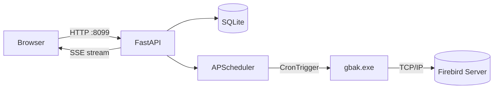

# FB Backup Manager

Aplicação web **self-hosted** para gerenciamento automatizado de backups de bancos **Firebird**. Roda como Windows Service e expõe uma interface web acessível pelo browser em PT-BR.

---

## Navegação

| Documento | Descrição |
|---|---|
| [[instalacao\|Instalação]] | Como instalar e configurar no Windows |
| [[uso\|Uso]] | Como usar a interface web |
| [[arquitetura\|Arquitetura]] | Estrutura do projeto e decisões técnicas |
| [[modelos\|Modelos de Dados]] | Schema do banco SQLite |
| [[api\|API Reference]] | Endpoints REST e SSE |
| [[build\|Build e Distribuição]] | Como compilar o .exe e gerar o instalador |

---

## Visão Geral

## Stack

| Camada | Tecnologia |
|---|---|
| Backend | Python 3.12 + FastAPI + Uvicorn |
| Agendamento | APScheduler 3.10 (BackgroundScheduler) |
| Banco local | SQLite via SQLModel / SQLAlchemy |
| Criptografia | cryptography (Fernet / AES-128-CBC) |
| Serviço Windows | pywin32 (ServiceFramework) |
| Frontend | HTML5 + CSS3 + Vanilla JS (single-file) |
| Empacotamento | PyInstaller 6.6 (onefile) |
| Instalador | Inno Setup 6 |

## Versão Atual

| Campo | Valor |
|---|---|
| Versão | 1.0.0 |
| Porta padrão | 8099 |
| Python mínimo | 3.12 |
| Plataforma alvo | Windows 10 / Server 2016+ |
