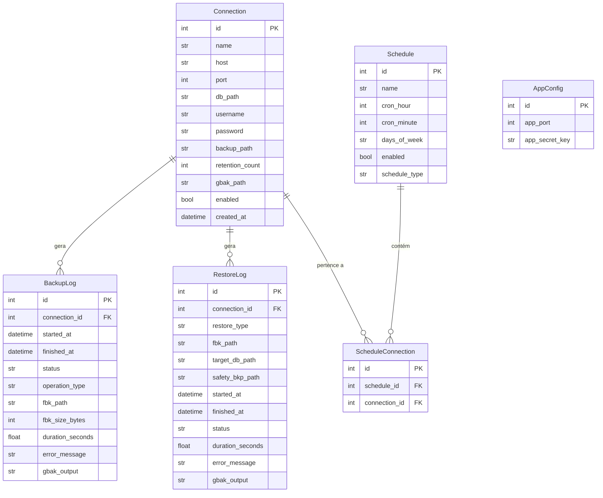

# Modelos de Dados

![[index|← Voltar ao índice]]

Todas as tabelas são gerenciadas pelo **SQLModel** sobre SQLite.
Arquivo: `<exe_dir>/data/fb_backup.db`

---

## Diagrama de Relacionamentos



---

## `Connection` — Conexões Firebird

| Campo | Tipo | Padrão | Descrição |
|---|---|---|---|
| `id` | int PK | auto | Identificador |
| `name` | str | — | Nome amigável |
| `host` | str | — | IP ou hostname do servidor Firebird |
| `port` | int | `3050` | Porta TCP |
| `db_path` | str | — | Caminho do `.fdb` no servidor |
| `username` | str | — | Usuário Firebird |
| `password` | str | — | Senha **criptografada** com Fernet |
| `backup_path` | str | — | Pasta de destino dos arquivos `.fbk` |
| `retention_count` | int | `7` | Número máximo de cópias mantidas |
| `gbak_path` | str\|null | `null` | Caminho do `gbak.exe` *(obrigatório para backup)* |
| `enabled` | bool | `true` | Se `false`, agendamentos ignoram esta conexão |
| `created_at` | datetime | utcnow | Data de criação |

> [!note] Connection string
> O campo `connection_string` não existe mais no banco. A string é montada dinamicamente por `build_connection_string()`:
> ```python
> f"{connection.host}/{connection.port}:{connection.db_path}"
> # → "192.168.1.10/3050:C:\dados\banco.fdb"
> ```

---

## `Schedule` — Agendamentos

| Campo | Tipo | Padrão | Descrição |
|---|---|---|---|
| `id` | int PK | auto | Identificador |
| `name` | str | — | Nome descritivo (ex: `Backup da noite`) |
| `cron_hour` | int | — | Hora de execução (0–23) |
| `cron_minute` | int | — | Minuto de execução (0–59) |
| `days_of_week` | str | `"0,1,2,3,4,5,6"` | Dias ativos: `0`=Seg, `6`=Dom |
| `enabled` | bool | `true` | Ativa/desativa o agendamento |
| `schedule_type` | enum | `BACKUP` | `BACKUP` \| `REINDEX` |

> [!example] Exemplo: dias úteis às 02:30
> `cron_hour=2`, `cron_minute=30`, `days_of_week="0,1,2,3,4"`

---

## `ScheduleConnection` — Vínculo N:N

Tabela de ligação entre `Schedule` e `Connection`.

| Campo | Tipo | Descrição |
|---|---|---|
| `id` | int PK | Identificador |
| `schedule_id` | int FK | Referência a `Schedule.id` |
| `connection_id` | int FK | Referência a `Connection.id` |

Um `Schedule` pode ter múltiplas `Connection`s. Quando o job dispara, o `_job_func` itera sobre todos os vínculos e executa `run_backup` (se `schedule_type=BACKUP`) ou `run_reindex` (se `schedule_type=REINDEX`) para cada conexão ativa.

---

## `BackupLog` — Histórico de Backups

| Campo | Tipo | Padrão | Descrição |
|---|---|---|---|
| `id` | int PK | auto | Identificador |
| `connection_id` | int FK | — | Qual conexão foi copiada |
| `started_at` | datetime | utcnow | Início da execução |
| `finished_at` | datetime\|null | `null` | Fim da execução |
| `status` | enum | `RUNNING` | `SUCCESS` \| `FAILED` \| `RUNNING` |
| `fbk_path` | str\|null | `null` | Caminho completo do `.fbk` gerado |
| `fbk_size_bytes` | int\|null | `null` | Tamanho em bytes |
| `duration_seconds` | float\|null | `null` | Duração total |
| `operation_type` | str | `"BACKUP"` | `"BACKUP"` \| `"REINDEX"` |
| `error_message` | str\|null | `null` | Mensagem de erro resumida |
| `gbak_output` | str\|null | `null` | Saída completa do gbak (verbose) |

> [!note] Status `RUNNING`
> O registro é criado com `status=RUNNING` antes do gbak iniciar. Se o processo for interrompido abruptamente (ex: serviço parado no meio do backup), o registro permanece como `RUNNING` indefinidamente.

---

## `RestoreLog` — Histórico de Restores

| Campo | Tipo | Padrão | Descrição |
|---|---|---|---|
| `id` | int PK | auto | Identificador |
| `connection_id` | int FK | — | Conexão utilizada |
| `restore_type` | enum | — | `CONNECTION` \| `SIMPLE` |
| `fbk_path` | str | — | Caminho do `.fbk` de origem |
| `target_db_path` | str | — | Caminho destino no servidor Firebird |
| `safety_bkp_path` | str\|null | `null` | Caminho do `.fdb.bkp` criado antes do restore |
| `started_at` | datetime | utcnow | Início da operação |
| `finished_at` | datetime\|null | `null` | Fim da operação |
| `status` | enum | `RUNNING` | `SUCCESS` \| `FAILED` \| `RUNNING` |
| `duration_seconds` | float\|null | `null` | Duração total |
| `error_message` | str\|null | `null` | Mensagem de erro |
| `gbak_output` | str\|null | `null` | Saída completa do gbak |

---

## `AppConfig` — Configuração Global

Tabela de linha única (`id=1`).

| Campo | Tipo | Padrão | Descrição |
|---|---|---|---|
| `id` | int PK | `1` | Sempre 1 |
| `app_port` | int | `8099` | Porta HTTP do servidor |
| `app_secret_key` | str | gerado | Chave usada para derivar a chave Fernet |

> [!warning] app_secret_key
> Gerado automaticamente com `secrets.token_hex(32)` na primeira execução. **Nunca altere manualmente** — isso invalidaria todas as senhas salvas, pois a chave Fernet é derivada desta string.

---

## Próximos passos

→ [[api|API Reference]]
→ [[restore|Restore]]
→ [[manutencao|Manutenção]]
→ [[arquitetura#Segurança|Segurança e criptografia]]
